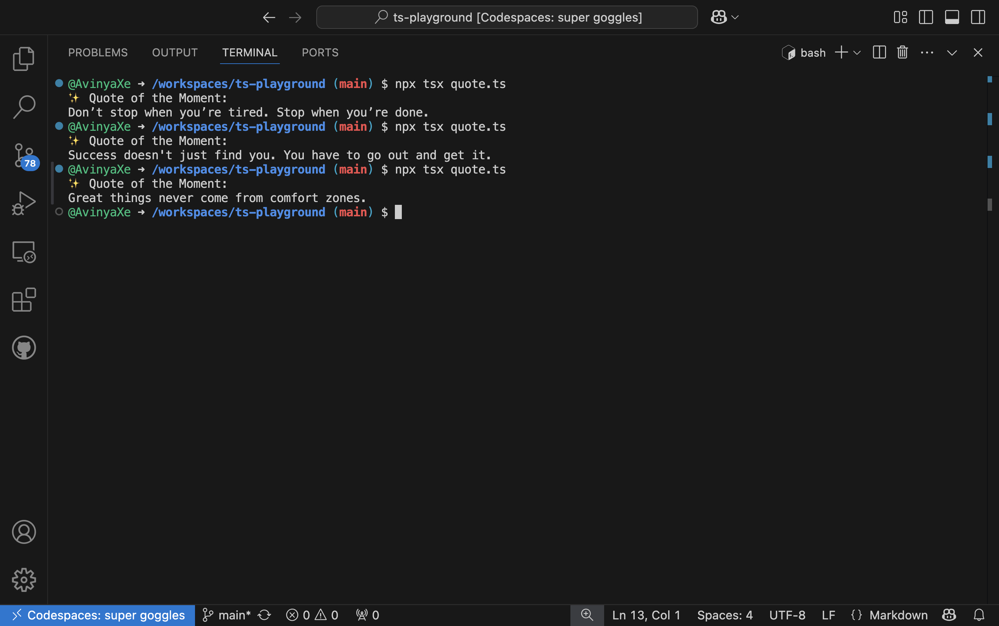

# ⚡ Random Quote Generator (TypeScript)

A simple yet slick **Random Quote Generator** built in TypeScript, powered by Node.js and some ✨ good vibes.

## 💡 What it does

- Outputs a random motivational quote in the terminal
- Clean CLI design
- Fully written in TypeScript
- Built with ❤️ in a GitHub Codespace

> Inspired by a random convo about TypeScript today.  
> Guess I finally gave in. Glad I did 😄

## 📸 Screenshot



## 🚀 Run it locally

```bash
# install dependencies
npm install

# run the quote generator
npx tsx quote.ts
